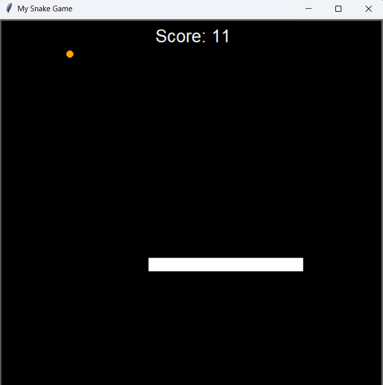

# 🐍 Python Snake Game

A classic 2-player Snake game built entirely in Python using the `turtle` graphics library.

## 🎮 Features
- Multi- and Single Player option
- Control the snake with the arrow keys or w/s/a/d for the second player
- Snake grows when eating food
- Game Over when hitting walls or itself
- Replay with key **r**
- Scoreboard display
- Tracking your personal highscores (Single Player Mode)

## 🎮 Technologies and Techniques
- Python 3.10+
- Object Oriented Programming
- Turtle Graphics

## 🧰 Requirements
- Python 3.10+
- (Optional) PyCharm or VSCode

## 🖼️ Preview


## ▶️ Run the Game

```bash
   python main.py